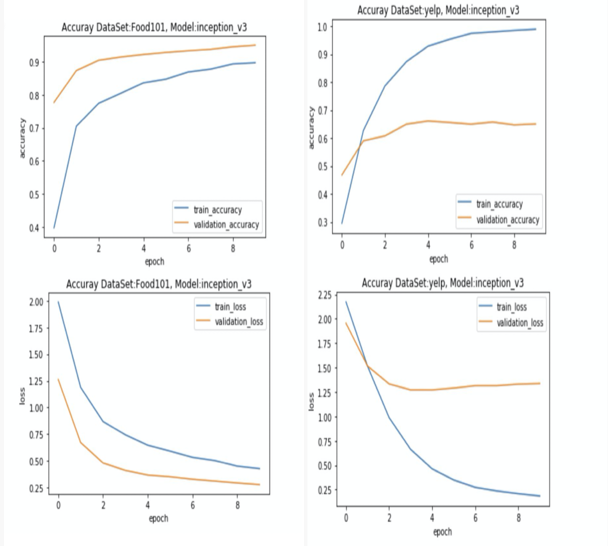
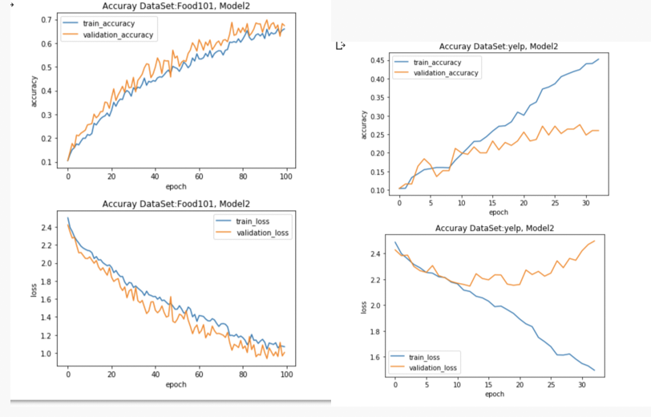
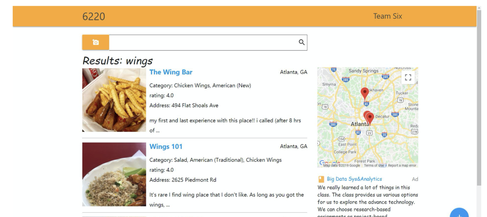

# CS 6220 
## DataPreprocessing

In this project, we used two datasets. One is yelp dataset, which url is https://www.yelp.com/dataset/download, another one is food101, which can be downloaded in http://data.vision.ee.ethz.ch/cvl/food-101.tar.gz.

Food101 is a pretty good dataset, so we do not need any kind of preprocessing, however, in yelp's datasets, there is no food class label. What I did is to generate the file "foodComment.txt". After that, we used the critical term in the comments to label the pictures. 

Those codes are in the DataPreprocessing.ipynb in the DataPreprocessing folder.

Btw, the food class I have chosen is foodClass = {"cheesecake", "mussels", "waffles", "pizza", "fried_rice", "dumplings",  "steak", "tacos", "donuts", "sushi"}.

I disregard the 50+ classes in the previous version, just to let everything more clear and save time in training.

## Model training

I used two models in this project. The first one is Inceptionv3 model. The second one is the model in the second reference. They are both written in python, and chosen a 3 class subsets of food101.

What I am do here is to update their model to fit the case of 10 classes, also I have tested them on both Yelp's dataset and Food101 dataset.

I gave up the model of WISeR and ResNet200 and chosen the model2 because the results of model2 have much more significance diffrence therefore can give much more information to analyze.

Another thing important in  comparison is that the two datasets have different size. Each class in food101 has 1000 pictures, while each class in Yelp only has 100 pictures. This is simply because yelp does not have enough pictures in the given label.

The followings are the results I got.
### Model1: Fine tuning Inceptionv3 model with 10 classes

    

   

### Model2: Native model with some layers

    

   

### Analytics and comments
1. For the same model, I run it on different datasets, the results are different, for example,  for the inception_v3 model, the accuracy on the food101 set is about 90%, however, it is only 60% in yelp's dataset. This is quite easy to understand. Becasue the food101 is basically a good dataset. However yelp's datasets are not very good. My way of giving a picture label may end  up with the result that a picture will have more than one labels, and one  picture will stay in several food sets. This significantly lower the acurracy of model.

2. If we compare the results of model1 and model2. We will find that model1 converges much quicker than model2. This is easy to understand. In model1, we have prior knowledge of food recognization, while in model2, we know nothing in ahead.

3. Next, let us compare the two pictures in the Model2. The left one is dataset Food101, it converges well in the picture and have an accuracy of about 70%, however, in the right side, 
it converegs about 30%. I asssume that the food101 has much more distinct characteristics, so it is easy for the model to grasp the key characteristics. However, in the yelp dataset, there are many misleading informtaion, the model can not give an accuracy model and find the key charactersize during those information.
  

### Reference
1. https://colab.research.google.com/github/theimgclist/examples/blob/MultiClassTF2.0/community/en/multi_class_classification/food_classifier.ipynb

2. https://github.com/rileykwok/Food-Classification

## Recommendation System

This part is the fronted_End of the previous part. What we are going to do here is to upload any picture, after that, we used our models to produce a label for that picture. SearchAPI.py is what I wrote to search for a nearby reasturant using the returned food label by Yelp's API. A website was developed to display the results.

To run this part, please go to the directory recommendationSystem, input
***python manage.py runserver*** in the terminal.

The following are an example of our results.

## Future Work

The future work was designed to predict a person's resturant preference base on his friends's historical data, we generated two files, one is user's friendShip, the other one is the history data of user. Those files are in the folder futureWork. This did not work because in this data, a user has very small amount of friends, the information is simply not enough to do predictions. 
